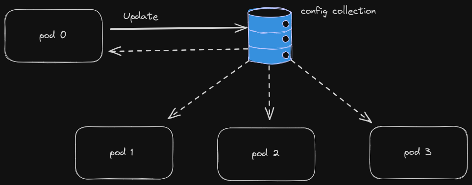

# Dynamic configuration



This library implements a hot-reloadable configuration repository. It leverages [mongodb change-streams](https://www.mongodb.com/docs/manual/changeStreams/) 
to stream changes that happen in a configuration collection into the local configuration repository.

This pattern can be used in distributed systems for feature-flag activations/deactivations and for distributed 
 eventually-consistent hot-reloadable configuration changes. 

A typical usecase is a kubernetes replicaset with multiple pods - upon configuration changes all pods local configurations will be updated.

* default values are not persisted, they are local-only. This allows you to change default values 
when rolling out new configuration versions.

The user-provided configuration must support `json` field tags for serialization/deserialization.

## Design

* Auditable: the lib aims at keeping historical information about configuration changes - this is achieved at the price of 
a higher storage usage as each configuration change translates to a new document in the collection containing all configuration 
fields.
* Immutable: the configurations are versioned and immutable - every update is reflected as a new document.
* Eventually-consistent: a configuration change will be replicated to the other local repositories eventually.

## Usage

checkout the [example](./example/main.go).

1. Define a configuration with `json` field tags (and optionally with `default` field tags):
2. Make sure that your configuration type implements the `streamingconfig.Config` interface:
3. Instantiate and start the repository and use it. 

## Test

```shell
make dependencies_up
make tests
```